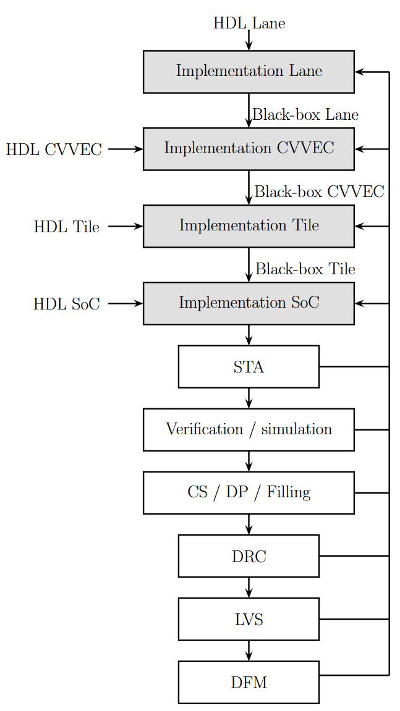
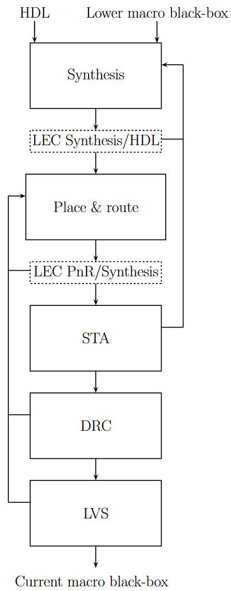

# GF22 back-end flow repository for CORE-V Polara

This repository contains the back-end flow for the CORE-V Polara chip using Global Foundries' 22 FDX FD-SOI technology. The following steps will tell you how to setup and run the flow.
- [GF22 back-end flow repository for CORE-V Polara](#gf22-back-end-flow-repository-for-core-v-polara)
- [Directory structure](#directory-structure)
- [Setup](#setup)
	- [Clone the repo](#clone-the-repo)
	- [Link the design](#link-the-design)
	- [Setup the technology files](#setup-the-technology-files)
- [Targets](#targets)
	- [Lane](#lane)
	- [CVVEC](#cvvec)
	- [Tile](#tile)
	- [SoC](#soc)
- [Flow recipes](#flow-recipes)
	- [Recipe setup](#recipe-setup)
	- [Run entire flow](#run-entire-flow)
	- [Run single macro](#run-single-macro)
	- [Synthesis](#synthesis)
	- [Place \& Route](#place--route)
	- [Other recipes](#other-recipes)

# Directory structure
```
Makefile		-- Makefile of the be flow
setup.csh		-- Loads the tools to run the flow
Flist.*			-- Filelists for simulation
constraints/	        -- Design constraints
synopsys/		-- Synthesis scripts
innovus/	 	-- Place & route scripts
tempus/			-- Signoff scripts (STA + power)
spyglass/ 		-- Linting scripts
virtuoso/		-- Miscellaneous be scripts
calibre/ 		-- LVS & DRC scripts
conformal		-- LEC scripts
sourcecode/             -- Synthesizable wrappers (For memories & FLL)
technology/		-- GF22 technology files
```

# Setup
In order to properly setup the source files and the GF22 technology librairies, follow these steps:

## Clone the repo

`git clone https://github.com/PolyMTL-Gr2m/corev_polara_be.git /path/to/repo`


## Link the design
1. Create a rtl directory.

	```
	mkdir rtl
	cd rtl
	```

2. Create symbolic links to the CORE-V Polara design repo.
   
	```
	ln -s /path/to/corev-polara-apu openpiton
	```
	Make sure the design repository is properly configured and contains the Ara and CVA6 repos.
	
## Setup the technology files
1. Run the technology recipe to populate the technology folder. This will take a while.

	```
	cd ../be/gf22
	source setup.csh
	make technology
	```
	
# Targets

The back-end flow is hierarchical and is using a bottom-up approach. This means we need to completely place & route the lower macros before running the upper macros. In each macro, the lower one is used as a black-box model.

The macro implementation order is the following :

Lane -> CVVEC -> Tile -> SoC

## Lane
This target is a single CVVEC (or ARA) Lane. When building the other targets, the Lane will be implemented first if it's not implemented already.

## CVVEC
This target is CVVEC (or ARA). It contains 4 Lanes and one CVA6 core. 

## Tile
This target is a single OpenPiton Tile. It contains one CVVEC instance and the L1.5 and L2 memory macros.

## SoC
This target is the top level target that implement the CORE-V Polara SoC. It contains 4 Tile instances, the chip bridge FIFO macros, the I/O cells and the FLL.


# Flow recipes
The back-end flow is shown in the figures below. The first figure shows the entire flow, the second figure shows the macro level flow.





## Recipe setup
Make sure you always run a flow recipe in the `/be/gf22` directory and make sure that you ran `source setup.csh` at least one time.

## Run entire flow
To run the entire place & route flow for the CORE-V Polara Soc, you can run the following command:
`make soc`.

## Run single macro
To run a single macro you can run the following command:
`make macro_name`.

## Synthesis 

To run synthesis on any target, you need to append `_synth` with the macro name of you choice. For example, with the CVVEC macro you would run
`make cvvec_synth`.

## Place & Route

To run place and route on any target, you need to append `_pnr` with the macro name of you choice. For example, with the CVVEC macro you would run
`make cvvec_pnr`.

## Other recipes
Many other recipes are present in the Makefile. Make sure to look it up to understand the different options and how the flow works. Here are a couple of recipes you can use:
```
_elab 		-- Elaboration recipe for synthesis
_lib		-- Macro library post-synth
_db		-- Compiled macro library post-synth
_lib_pnr	-- Macro library post-synth for PnR (Cadence tools)
_mw		-- Milkyway library post-synth
soc_sdf		-- SDF file generation for SoC
soc_sta         -- Signoff STA for SoC
soc_add_cs	-- Adds crackstop to SoC
soc_dp		-- Multi-patterning (coloring) for SoC
soc_art		-- Silicon art for SoC
soc_fill	-- Metal fill for SoC
```